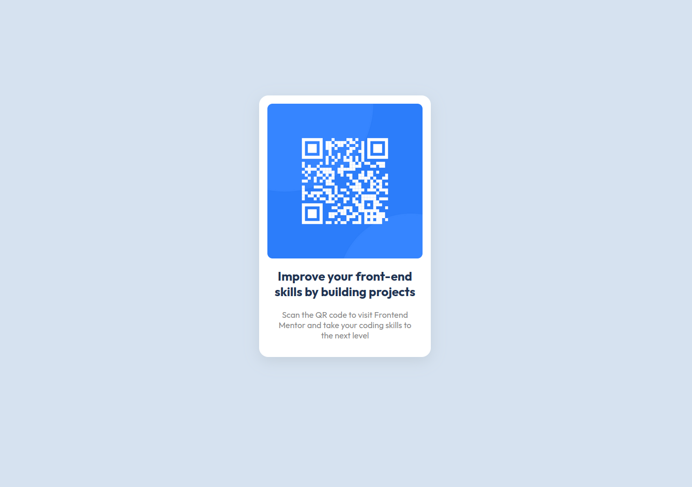

# Frontend Mentor - QR code component solution

This is a solution to the [QR code component challenge on Frontend Mentor](https://www.frontendmentor.io/challenges/qr-code-component-iux_sIO_H). Frontend Mentor challenges help you improve your coding skills by building realistic projects. 

## Table of contents

- [Overview](#overview)
  - [Screenshot](#screenshot)
  - [Links](#links)
- [My process](#my-process)
  - [Built with](#built-with)
  - [What I learned](#what-i-learned)
  - [Continued development](#continued-development)
  - [Useful resources](#useful-resources)
- [Author](#author)
- [Acknowledgments](#acknowledgments)

## Overview

### Screenshot



### Links

- Live Site URL: [Vercel](https://qr-code-component-main-ou4o.vercel.app/)

## My process

### Built with

- Semantic HTML5 markup
- CSS custom properties
- Flexbox
- CSS Grid

### What I learned

When I made structure for card using divs, it was the most rewarding part of the project how the layout was getting structured 

```html
<div class="qr-component-card">
    
    <div class="font">
      <h2 class="outfit-700">Improve your front-end skills by building projects</h2>
      <p class="outfit-400">Scan the QR code to visit Frontend Mentor and take your coding skills to the next level</p>
    </div>
</div>
```

Shadowing div was lot more chalenging than I thought it would, but some how I made it, its not the picture perfect copy of the design but its close by.
```css
box-shadow: 0px 8px 25px hsl(210, 26%, 82%);
```

### Continued development

I would definitely love to get more comfortable with css, and this qr component project could improve a lot more when it comes to responsive design, making it compatible on both mobile and desktop.

### Useful resources

- [Scrimba](https://v2.scrimba.com/home) - Scrimba has ton of free resources and course, they helped me learn HTML and CSS.
- [w3Schools](https://www.w3schools.com/css/) - Check out their CSS resources!

## Author

- Website - [Dhanush Kumar](https://www.dhanush-kumar.in)
- Frontend Mentor - [@dhanush-kuma](https://www.frontendmentor.io/profile/dhanush-kuma)

## Acknowledgments

Keep Learning!